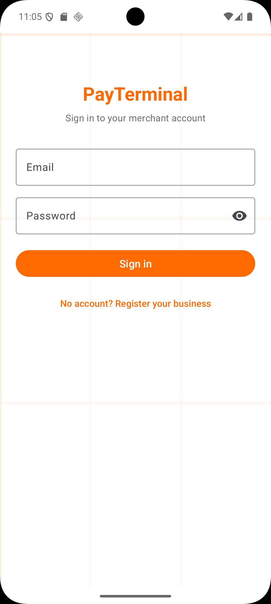
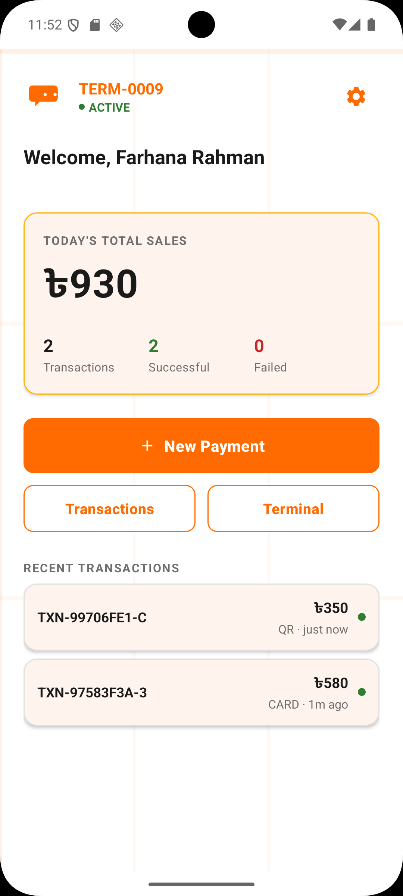
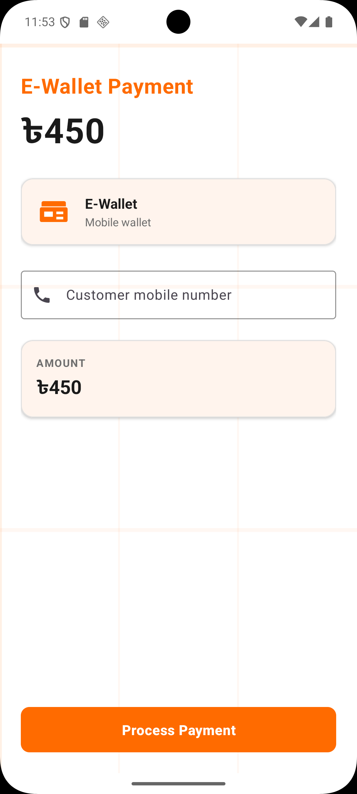
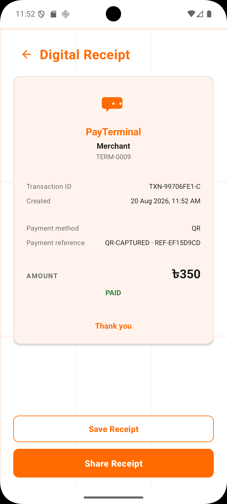
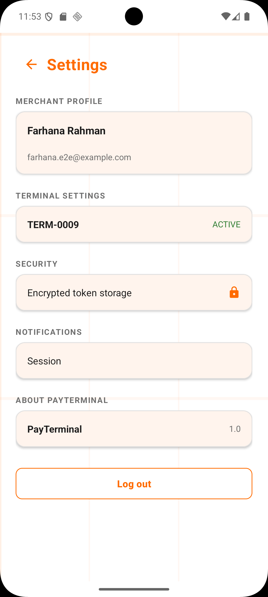

# PayTerminal

Android POS payment terminal simulator.

## 📸 Screenshots

### Login & Dashboard

| Login | POS Home |
| --- | --- |
|  |  |

### Payment

| Payment Method | Payment Amount Input | Payment by Card | Payment by E-wallet | QR Payment | E-Wallet |
| --- | --- | --- | --- | --- | --- |
|  |  |  |  |  |  |

### Result, Receipt & Settings

| Card Successful | Receipt | Settings |
| --- | --- | --- |
|  |  |  |

## 💳 Payment Flow

```text
User
  ↓
Payment Screen (amount + method selection)
  ↓
Processing (~1.4s local simulation)
  ↓
Success / Failed
  ↓
Room Persistence (PaymentTransactionEntity)
  ↓
Transaction History (filtered/list view)
  ↓
Receipt (generated on success)
```

**Important:** PayTerminal v1.1 performs payment processing as a **LOCAL SIMULATION**.

- No real bank deduction
- No real MFS deduction
- No real payment gateway
- No real money movement
- The application simulates the payment lifecycle and persists the transaction locally via Room

## ↩️ Refund Flow

```text
OWNER
  ↓
Select Transaction from history
  ↓
Refund Request (enter amount ≤ original)
  ↓
Processing (local simulation)
  ↓
Completed / Rejected
  ↓
Local Transaction Update (status → REFUNDED)
  ↓
Receipt/Refund record updated; UI reflects new state
```

**Important:** PayTerminal v1.1 refunds are **simulated locally**.

- No real financial reversal
- No real money movement
- The refund state machine is: `Requested → Processing → Completed / Rejected`
- The transaction status moves `SUCCESS → REFUNDED`, `refundedAt` timestamp set
- All state changes are persisted locally in Room

## 👥 Role Demonstration

| Feature                    | OWNER | CASHIER |
| ------------------------ | :---: | :---: |
| Login                    | ✅    | ✅    |
| Payment                  | ✅    | ✅    |
| Transaction History      | ✅    | ✅    |
| Refund                   | ✅    | ❌    |
| Terminal Management      | ✅    | ❌    |
| Card expiry formatting   | ✅    | ✅    |

**Verification:** These restrictions were tested and confirmed on the emulator:

- **CASHIER:** Terminal tab hidden, Refund button hidden on transaction details, `RefundViewModel.confirm()` returns `"Only the business owner can refund payments"`
- **OWNER:** Full access to Terminal tab, Refund button visible and functional, Terminal Management operational

## 🏗️ Architecture

```yaml
Android App
    ↓
Repositories (Room, Retrofit, Hilt)
    ↓
Domain State Machines (Transaction + Refund)
    ↓
Local Persistence (Room — PostgreSQL mirror)
```

**Server‑side (ASP.NET Core + PostgreSQL):**

- JWT authentication & token refresh
- Merchant registration + `GET /api/v1/merchants/{id}`
- Terminal registration + pairing + `POST /api/v1/terminals/{id}/heartbeat`
- Domain state machines (Transaction + Refund) — pure business logic, no UI
- Role constants: `Owner` / `Cashier`
- No payment‑processing gateway integration (v1.1 local simulation)

**Local v1.1:**

- Payment simulation — local only, no external gateway
- Refund simulation — local only, no external reversal
- Room transaction persistence — source of truth for Android app
- Merchant caching on login — fetched from backend, stored locally
- Terminal heartbeat monitoring — `POST /api/v1/terminals/{id}/heartbeat`
- Online/Offline status — determined by heartbeat freshness
- Card expiry MM/YY auto‑format — local formatting rule
- Role‑based UI gates — enforced both in Fragments and ViewModels

**Future v2.0:**

- Server‑driven payments API with real payment gateway integration
- Server‑driven refunds with real transaction reversal
- Transaction synchronization & reconciliation database
- Real settlement and fraud/risk management
- PCI‑compliant card data handling considerations

## 📦 Release

- **Version:** v1.1 (Phase 8 Polish)
- **APK:** `app-release-signed.apk` (signed with keystore, zipaligned)
- **Release notes:** Merchant profile on login, health monitoring, expiry auto‑format MM/YY, unit tests, role restrictions, API additions

## 📜 License

MIT License

## 📧 Contact

Portfolio project — contact via GitHub repository.